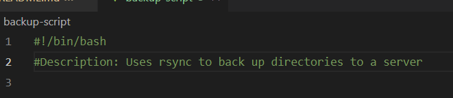
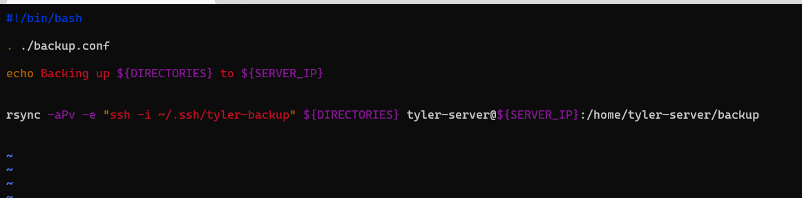
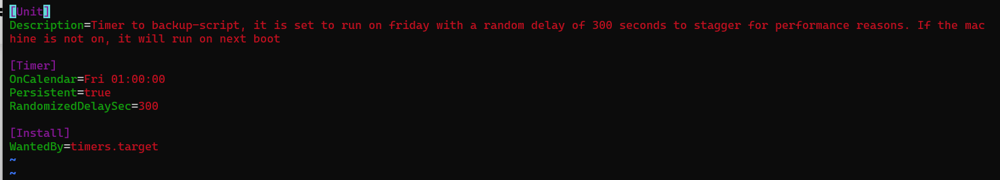

# 2420_week11_lab
# Backing up files with rsync as a service
###Creating your script
When writing your script you will want to write code that can be read properly we can include a header with descriptions and a shebang.

In this instance we are using rsync:
```
    rsync options /path/to/host/file new_user@host_ip:/path/to/save/to
```

In this peticular script we are writing settings in a backup.conf file to save directories we would like to back up for readability and ease of tracking.

In this file I did something like
```
    DIRECTORIES="/path/one /path/two"
    SERVER_IP=xxx.xx.xx.xxx (this will be the ipaddress to the host you would like to back up to)
```

My script looked like this:


###Creating your service file
Start by naming your file foo_bar.service and then editing it in such a way that it includes a [Unit], [Service] and [Install].
There are many resources online as to what you can put here so I will not be going into detail about this.


###Creating your timer
Making sure to put a randomized delay in we will follow a similar format to the service file making sure to name is foo_bar.timer and including [Unit], [Timer] and [Install] sections


